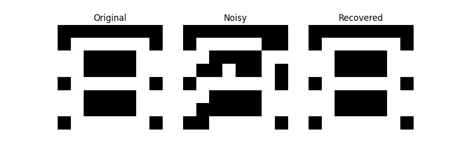

# 🧠 Hopfield Neural Network (From Scratch)

This project is a **from-scratch implementation of a Hopfield Neural Network** using **NumPy**.  
It demonstrates how a Hopfield network can **store a pattern and recover it from noisy input** using **Hebbian learning** and **iterative state updates**.

---

## 🤖 What is a Hopfield Neural Network?

A Hopfield Neural Network is a **recurrent neural network** used as an **associative memory**.

- Stores patterns as **stable states (attractors)**
- Can recover the original pattern from **corrupted or noisy input**
- Uses **binary bipolar neuron states**: `{−1, +1}`

Hopfield networks **do not use backpropagation** and **do not require datasets**.

---

## 🧬 How does it learn?

This implementation uses **Hebbian learning**:

> *“Neurons that fire together, wire together.”*

The weight matrix **W** is computed as:

W = pattern ⊗ pattern


Where:
- `⊗` is the **outer product**
- **Self-connections are removed** (`W[i][i] = 0`)

Only **one pattern** is stored in this project to clearly demonstrate the learning mechanism.

---

## 🔁 How does recall work?

- A noisy version of the pattern is created by **randomly flipping bits**
- Neurons are updated **asynchronously**, one at a time
- Each neuron updates its state using the **weighted sum of all other neurons**
- The process repeats until the network **converges to a stable state**

The final stable state corresponds to the **stored memory**.

---

## 🧩 Why an 8×8 pattern?

Hopfield networks have **very limited memory capacity**.

- Maximum capacity ≈ `0.138 × N` patterns  
- For `64` neurons → **~8–9 patterns max**

Because of this limitation:
- A **simple 8×8 binary pattern** was chosen
- This avoids pattern interference
- Makes recovery behavior easy to visualize
- Real high-resolution images are **not suitable** for basic Hopfield networks

---

## 📊 Result Visualization



The network successfully recovers the original pattern from a noisy input.

---

## 🛠 Technologies Used

- Python
- NumPy
- Matplotlib

No machine learning frameworks were used.

---

## ▶️ How to Run

```bash
python main.py

